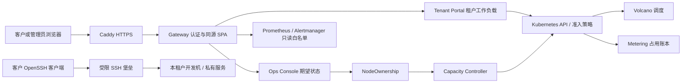

# 平台架构

更新：2026-09-07。本文描述仓库当前实现；生产环境的验收状态见 [生产就绪清单](production-readiness.md)。Lab 为 CPU kind，真实部署目标为头节点加 4 台 DGX；扩展到 8 台、SSO、对象存储及多副本 HA 均需另行设计验收。

## 组件与权限边界

| 组件 | 职责与边界 |
|---|---|
| `web/` | Vue 3 + TypeScript + Arco；路由与页面按角色展示，深浅主题、中英 JSON 词库；页面隐藏不作为授权手段 |
| `services/gateway/` | 认证、角色/租户校验、CSRF、限流、代理和 SPA；不挂 Kubernetes SA token。`/papi` 到租户 API，`/oapi` 到运维 API，指标端点只开放受控 GET |
| `services/tenant-portal/` | 注册租户的 Pod、Volcano Job、Deployment、Service、ConfigMap、PVC 操作；RBAC 限定工作负载命名空间 |
| `services/ops-console/` | 读取机群和运维状态，只写 NodeOwnership 期望状态，不直接修改节点标签、污点或 cordon |
| `services/capacity-controller/` | 独占所有权状态机与节点变更，排空、合同检查、清理、隔离和恢复；持久状态 ConfigMap 按名字授权 |
| `services/metering/` | 按资源分配区间追加账本并提供用量；`billing/invoice.py` 离线核链和计算发票 |
| `services/auth-backup/`、`services/ledger-backup/` | 分别做 SQLite 一致快照和账本副本回读校验；两种数据格式与验证语义不同 |
| `services/ssh-bastion/`、`services/devbox/` | 公钥绑定租户，受限目标转发与客户 SSH；入口不持有管理员 kubeconfig |
| `services/fake-gpu-plugin/`、`services/vast-mock/` | 仅 lab 的设备契约与市场状态模拟，不部署为生产 GPU 或生产交易适配器 |

后端分开部署是为了维持不同 RBAC 和故障边界。Python 业务服务使用标准库、由 ConfigMap 交付；SSH 使用 OpenSSH，设备模拟使用 Go，SPA 通过构建产物交付。生产前端使用内容镜像，lab 使用宿主挂载；更新代码 ConfigMap 后需重启进程才能执行新代码，Makefile 的代码发布入口负责激活和等待就绪。

## 身份与接入

网页身份包括 admin 和固定租户 user。PBKDF2 密码哈希、用户身份版本及退出撤销写入 retained SQLite；签名 cookie 每次请求还会核对当前用户，删除、改密或降权后旧身份不能继续使用。耗时密码计算在身份锁外执行，发会话前重新检查身份版本。

网关支持单写入者，Deployment 为单副本 Recreate。正常重启保留账号和撤销记录；备份恢复必须轮换会话签名密钥，见 [账号恢复](../runbooks/auth-recovery.md)。无外部身份库或一致性设计时不能直接增加副本。

Caddy 自带 ACME，在显式切流时启用。SSH 组织入口公钥和网页账号独立授权，开发机还有自己的公钥认证；撤销需同时处理对应身份。在线服务向授权客户提供本机隧道，尚无匿名公网推理 API。具体信任、端口及撤销流程见 [公网入口](../runbooks/public-edge.md) 和 [租户接入](../runbooks/tenant-access.md)。

## 所有权与租户隔离

`controller/crd.yaml` 定义 NodeOwnership schema 和合同不变量。节点在 ARISE、DIRECT、VAST 及维护/隔离流程间转换；DIRECT 必须绑定具体租户。控制器共享转换检查并分派各 owner 的处理逻辑：合同、排空与清理门没有通过时不得回池或重新出售，外部副作用不确定时停在隔离流程。

`platform/tenants.yaml` 是租户、owner 类别、队列与优先级的注册来源。命名空间标签驱动准入与网络围栏，新增租户通过生成器和一致性门接入全部消费者。普通租户不能修改命名空间标签，不能借 nodeSelector、affinity、toleration 或队列声明进入其他租户的 DIRECT 节点。网络策略和最小 RBAC 同时限制直接访问内部服务。

租户负载遵守 restricted PSA，默认不挂 SA token；容器共享内核，不承诺 VM 级隔离。生产 VAST adapter 默认禁用，lab 市场模拟通过不代表生产市场已可售。

## 资源与调度

Volcano 使用仓库固定版本的清单，队列表示商业权益，节点 owner/pair 表示资源池和放置条件。客户专属保障依靠 DIRECT 节点预留，不能把全局队列权重换算成任何拓扑下都可兑现的容量保证。跨队列 reclaim 的历史局限见 [技术边界](../runbooks/gaps.md)。

| 资源 | 当前规则与来源 |
|---|---|
| CPU | 500m 网格；原生资源用于 DGX，lab 另有模拟整机容量 |
| 内存 | 512Mi 网格；监控与计量按实际 Kubernetes 单位归一化 |
| GPU | 整数卡；单节点最多 8 卡，生产 `nvidia.com/gpu`，lab `arise.dev/fake-gpu` |
| PVC | 10Gi 网格，允许 `arise-shared` / `arise-longterm`，受租户及 StorageClass 配额限制 |

实际强制点是两套 overlay 的 flavor/准入策略及租户配额，门户规格目录只是创建预设。修改网格必须同步 API 校验、前端、LimitRange、准入策略和测试，不能只改一个页面或一条规则。CPU-only 负载在 lab 使用 CPU 池，在现有 DGX 配置使用可用 GPU 节点的 CPU 资源。

开发机为 Pod、可选 PVC 和 SSH Service；训练为 Volcano Job，遵守 gang 启动；服务为 Deployment 与 ClusterIP。任务日志/实例/事件可在详情查看。HPA、工作流编排、模型资产中心及通用 Python SDK 尚未实现。

## 存储、计量与监控

两种存储类目前都使用 local-path：`arise-shared` 删除卷后清理数据，`arise-longterm` 使用 Retain。卷绑定节点，名称中的 shared 不表示跨节点共享文件系统；PVC 申请容量/配额不等于逐卷写入硬限制。开发机默认保留数据卷，临时 home/tmp 随 Pod 消失。数据保障、清理和备份需按合同及手册落实。

计量记录已分配资源占用，包括初始化、拉取镜像与容器重启期间；未分配的排队 GPU 不计占用。账本是 append-only 哈希链，生产使用 HMAC，独立链头锚点与副本用于复核。发票由价格表和明确预留区间离线生成；没有自动支付闭环。当前历史查询仍是内存线性扫描，明细响应有上限，大规模长期运营需评估索引与分页。

Prometheus/Alertmanager 为运维来源，失败不能伪装成零告警或零用量。机群 CPU/内存字段统一为 vCPU/GiB，普通 init container 纳入有效申请量；外部注入的可重启 sidecar 和 Pod 级资源需另行做完整核算验收。监控预设到 30 天，自定义最多 90 天，但实际保留为 lab 3 天、DGX 15 天；查询范围不承诺存在对应历史数据。

## 验证与演进

验证入口见 [开发指南](development.md)，具体本轮结果见 [架构复查](review-2026-09-07-architecture.md)。硬件、生产网络、离机恢复、长期负载及其他浏览器的剩余项统一维护在 [生产就绪清单](production-readiness.md)。扩容时要同时评估调度拓扑、控制面故障域、身份与账本一致性、SSH 并发和存储保障，不以增加节点或副本数量作为完整方案。
